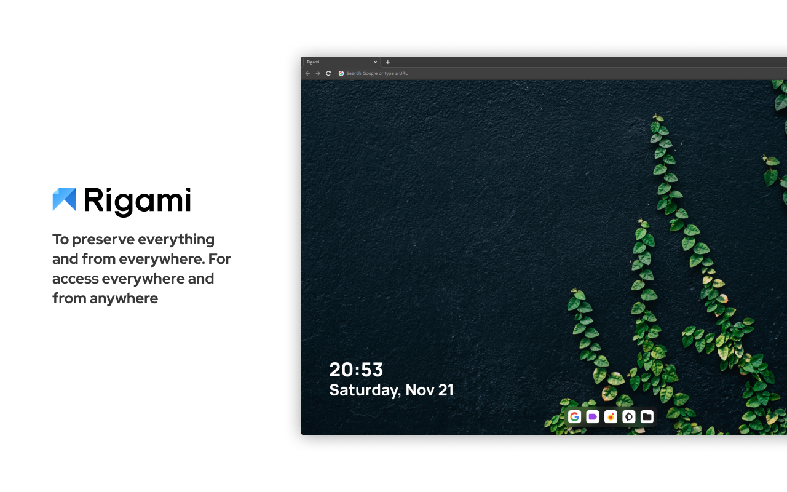
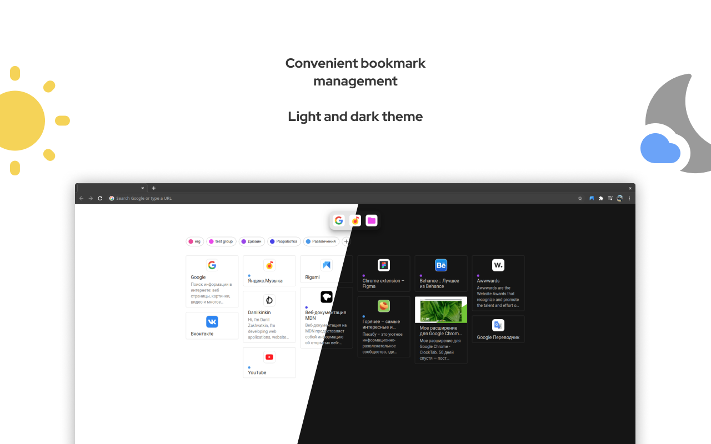
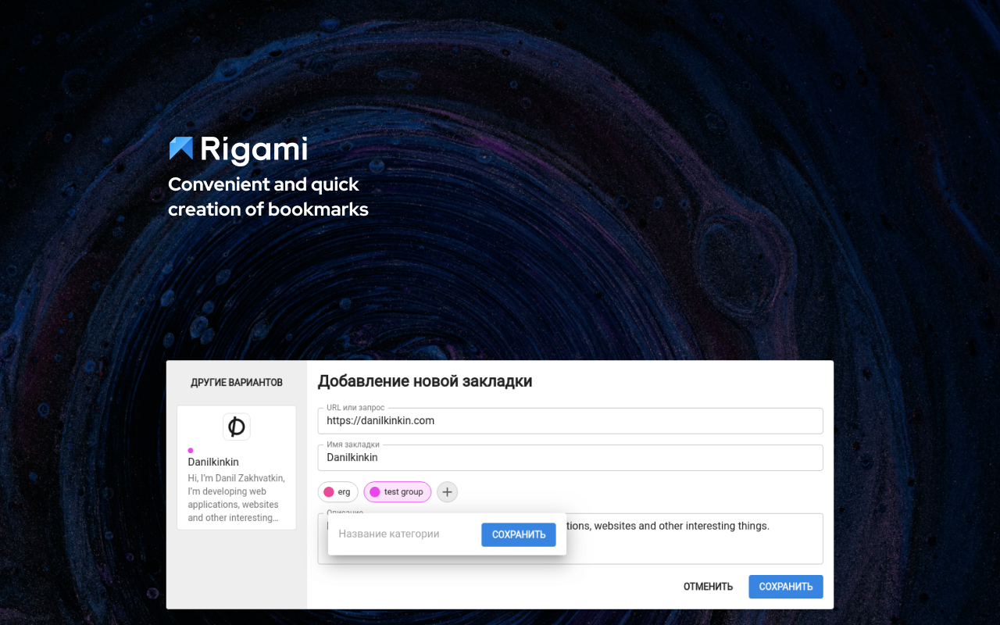
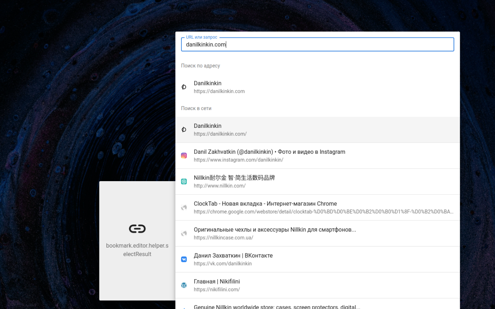
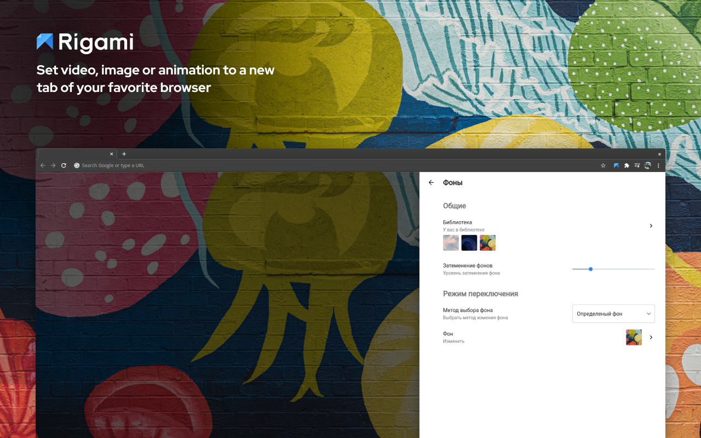

[](https://chrome.google.com/webstore/detail/clocktab-%D0%BD%D0%BE%D0%B2%D0%B0%D1%8F-%D0%B2%D0%BA%D0%BB%D0%B0%D0%B4%D0%BA%D0%B0/ecnhbihahclkcfhpjhpgfilbjeambkkm)


Simple and beautiful new tab for chrome Transform your start page in your browser with live wallpapers.
## Build & Develop

### Develop build
```bash
$ yarn dev
```

### Production build
Create release build. This command will create a zip file of release build in folder release in root of project.
```bash
$ yarn build:zip
```
Analyze release build 
```bash
$ yarn build:analyze
```

## Screenshots






